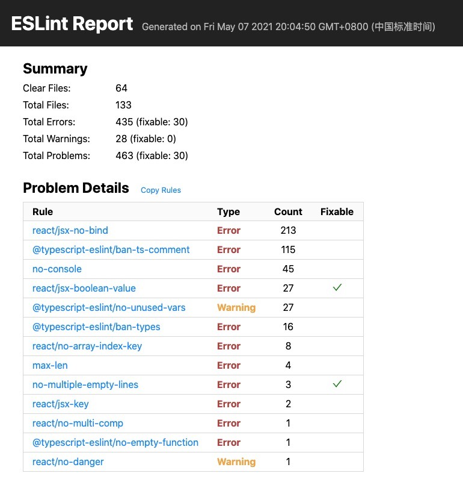
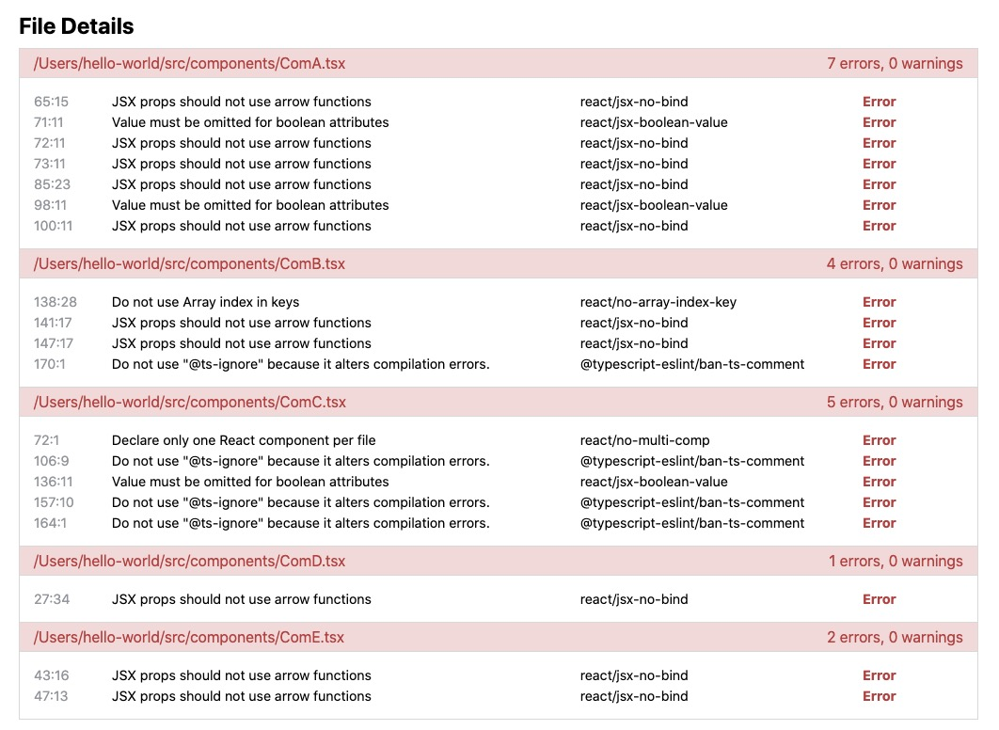

# eslint-rich-reporter


## Usage

```bash
yarn add -D eslint-rich-reporter
# or
npm i --save-dev eslint-rich-reporter

# run script
npx eslint -f node_modules/eslint-rich-reporter/reporter.js -o eslint-report.html
```

## Features

### Result Summary



### File Details


